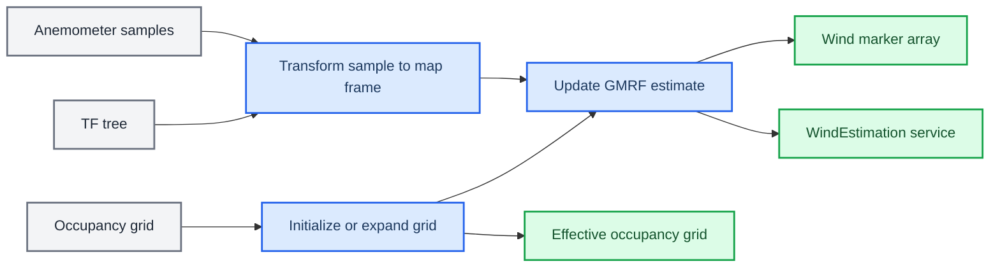

# GMRF-wind

_ROS 2 Humble reference for online two-dimensional wind-field estimation from sparse anemometer measurements._

---

GMRF-wind contains a C++ wind-mapping node and its custom query service. The node builds a Gaussian Markov random field (GMRF) over a `nav_msgs/msg/OccupancyGrid`, transforms each anemometer observation into the configured map frame, solves for Cartesian flow components, publishes RViz markers, and serves point or full-grid queries.

The implementation follows the GMRF-W approach described by Monroy, Jaimez, and Gonzalez-Jimenez.[^1] This README documents the current `ros2` branch source, not the historical ROS 1 API.

## Overview

### Packages

| Package | Build type | Purpose |
| --- | --- | --- |
| `gmrf_msgs` | `ament_cmake` + `rosidl` | Defines `gmrf_msgs/srv/WindEstimation` |
| `gmrf_wind_mapping` | `ament_cmake` | Builds the `gmrf_wind_mapping_node` executable |

### Runtime data flow



The node does not publish a numeric wind-map message. Numeric estimates are available through `WindEstimation`; `wind_array_pub` is visualization output.

### Estimation model

The state contains two variables per grid cell: map-frame flow components `u` and `v`. The sparse weighted least-squares system includes:

| Factor | Parameter | Current role |
| --- | --- | --- |
| Neighbor regularization | `GMRF_lambdaPrior_reg` | Encourages adjacent connected cells to have similar components |
| Mass conservation | `GMRF_lambdaPrior_mass_conservation` | Penalizes finite-difference divergence in interior free cells |
| Obstacle constraint | `GMRF_lambdaPrior_obstacles` | Forces occupied cells, and blocked normal components, toward zero |
| Observation | `GMRF_lambdaObs` | Weights measured wind components inserted into the grid |

Each accepted measurement affects its containing GMRF cell and up to three adjacent cells. The solver updates at `exec_freq`; `GMRF_lambdaObsLoss` is subtracted from each non-invariant observation at every update, not once per second.

## Requirements and build

### Supported environment

This branch targets ROS 2 Humble on Ubuntu 22.04. The commands below follow the ROS 2 Humble overlay and `colcon` workflow.[^2]

Required source packages:

- `gmrf_msgs` from this repository
- `olfaction_msgs`, available in the same workspace or an already sourced underlay

Required system and ROS dependencies include Eigen3, OpenCV, `rclcpp`, `angles`, `tf2_ros`, `tf2_geometry_msgs`, `nav_msgs`, `visualization_msgs`, `geometry_msgs`, and the ROS interface generators.

> **Note:** The current `package.xml` files do not enumerate every dependency used by `CMakeLists.txt`. The explicit installation command below is more reliable than relying only on `rosdep` for this revision.

### Install dependencies

Assuming ROS 2 Humble is already installed:

```bash
sudo apt update
sudo apt install \
  libeigen3-dev \
  libopencv-dev \
  ros-humble-angles \
  ros-humble-geometry-msgs \
  ros-humble-nav-msgs \
  ros-humble-rclcpp \
  ros-humble-rosidl-default-generators \
  ros-humble-sensor-msgs \
  ros-humble-std-msgs \
  ros-humble-tf2-geometry-msgs \
  ros-humble-tf2-ros \
  ros-humble-visualization-msgs
```

### Build in GSExploration

```bash
cd ~/Workspace/Bio_ws
git submodule update --init --recursive

source /opt/ros/humble/setup.bash
source ~/Workspace/Libraries_ws/install/setup.bash

PATH=/usr/bin:$PATH colcon build \
  --packages-up-to gmrf_wind_mapping \
  --symlink-install

source install/setup.bash
```

`--packages-up-to gmrf_wind_mapping` builds discoverable workspace dependencies, including `gmrf_msgs` and `olfaction_msgs`. The `/usr/bin` `PATH` prefix avoids selecting a Homebrew Python that cannot import ROS build-time Python modules.

### Verify the installation

```bash
ros2 pkg executables gmrf_wind_mapping
ros2 interface show gmrf_msgs/srv/WindEstimation
```

Expected executable:

```text
gmrf_wind_mapping gmrf_wind_mapping_node
```

## Running the node

### GSExploration simulation

The parent workspace launch file starts this node when `enable_field_mapping:=True`:

```bash
ros2 launch main_decision demo_sim.launch.py \
  env_preset:=s5_lv1 \
  arm:=proposed \
  enable_field_mapping:=True
```

The simulation launch configures:

| Setting | Value |
| --- | --- |
| Node name | `gmrf_wind_node` |
| `sensor_topic` | `/wind_data` |
| `map_topic` | `/map` |
| `cell_size` | `0.5` m |

The real-robot launch configures the namespaced `wind_data` and `map` topics and uses a `0.6` m cell size.

> **Warning:** The current GSExploration launch helpers do not pass `use_sim_time` to `gmrf_wind_mapping_node`. For standalone simulation, set it explicitly if the node must use `/clock` for cooldown timing and marker timestamps.

### Standalone

Start the node after sourcing the workspace:

```bash
ros2 run gmrf_wind_mapping gmrf_wind_mapping_node --ros-args \
  -p frame_id:=map \
  -p sensor_topic:=/wind_data \
  -p map_topic:=/map \
  -p cell_size:=0.5 \
  -p use_sim_time:=true
```

The standalone node name is `/GMRF_wind`. It remains uninitialized until it receives an occupancy grid. After initialization it solves and publishes at `exec_freq`.

### Runtime checks

For the standalone command:

```bash
ros2 node info /GMRF_wind
ros2 topic info /wind_data -v
ros2 topic info /map -v
ros2 topic info /wind_array_pub -v
ros2 service type /WindEstimation
```

When launched by GSExploration, inspect `/gmrf_wind_node` instead.

## ROS interfaces

All names below are relative unless the configured parameter value starts with `/`. A namespace therefore changes `wind_array_pub`, `gmrf_occupancy`, and `WindEstimation`, but it does not change the default absolute sensor topic `/anemometer`.

### Subscriptions

| Name | Type | QoS | Purpose |
| --- | --- | --- | --- |
| `sensor_topic` (`/anemometer`) | `olfaction_msgs/msg/Anemometer` | Sensor data: best effort, volatile, depth 5 | Sparse speed and direction observations |
| `map_topic` (`map`) | `nav_msgs/msg/OccupancyGrid` | Reliable, transient local, depth 1 | Grid geometry, obstacles, and explored state |
| `/tf`, `/tf_static` | TF messages | Managed by `tf2_ros::TransformListener` | Sensor-frame to `frame_id` transforms |

The map QoS accepts a latched map from `nav2_map_server` or another transient-local publisher. Use `ros2 topic info /map -v` to diagnose QoS incompatibility.

### Publications

| Name | Type | QoS | Publication behavior |
| --- | --- | --- | --- |
| `wind_array_pub` | `visualization_msgs/msg/MarkerArray` | Reliable, volatile, depth 1 | Published at `exec_freq` after initialization |
| `gmrf_occupancy` | `nav_msgs/msg/OccupancyGrid` | Reliable, transient local, depth 1 | Published once at initial map selection |

`wind_array_pub` contains `ARROW` markers in namespace `WindVector`. Marker yaw is map-frame flow direction. Arrow length and color are normalized against the largest current estimated speed, so marker length is not an absolute speed scale.

`gmrf_occupancy` reports the map selected during initialization. Later dynamic occupancy updates are applied internally but are not republished on this topic.

### `WindEstimation` service

Service name and type:

```text
WindEstimation  gmrf_msgs/srv/WindEstimation
```

Interface definition:

```text
float64[] x
float64[] y
---
int64 map_width
float64[] u
float64[] v
float64[] stdev_angle
```

Query selected map-frame coordinates:

```bash
ros2 service call /WindEstimation gmrf_msgs/srv/WindEstimation \
  "{x: [0.0, 1.0], y: [0.0, 1.0]}"
```

Query the complete grid:

```bash
ros2 service call /WindEstimation gmrf_msgs/srv/WindEstimation \
  "{x: [], y: []}"
```

Service semantics:

| Field | Meaning |
| --- | --- |
| Request `x[i]`, `y[i]` | Map-frame query coordinate in meters |
| Response `map_width` | Number of GMRF cells along the x axis |
| Response `u[i]`, `v[i]` | Estimated map-frame flow components in m/s |
| Response `stdev_angle[i]` | Current placeholder uncertainty value; see limitations |

For a full-grid query, arrays contain `width × height` values in row-major order:

```text
index = x_cell + y_cell * map_width
```

Client requirements and edge cases:

- `x` and `y` must have equal lengths; the server currently does not validate mismatched arrays
- An empty `x` array requests the full grid; `y` is ignored in that case
- Out-of-bounds or filtered unexplored cells return `u = 0`, `v = 0`, and `stdev_angle = max(float64)`; this applies per cell in full-grid responses, not only to point queries
- A request received before map initialization is rejected: the handler logs an error and returns `false`, so `ros2 service call` reports the call as failed

## Parameters

Parameters are declared as ordinary ROS 2 startup parameters. The node has no parameter-change callback, so restart it after changing a value.

| Parameter | Type | Default | Meaning |
| --- | --- | --- | --- |
| `frame_id` | string | `map` | Target TF frame and marker frame |
| `sensor_topic` | string | `/anemometer` | Anemometer subscription |
| `map_topic` | string | `map` | Occupancy-grid subscription |
| `exec_freq` | double | `2.0` | Solve and marker publication frequency in Hz |
| `cell_size` | double | `0.5` | GMRF grid resolution in meters |
| `GMRF_lambdaPrior_reg` | double | `1.0` | Neighbor regularization weight |
| `GMRF_lambdaPrior_mass_conservation` | double | `10000.0` | Divergence penalty weight |
| `GMRF_lambdaPrior_obstacles` | double | `10.0` | Obstacle constraint weight |
| `GMRF_lambdaObs` | double | `10.0` | Initial observation weight |
| `GMRF_lambdaObsLoss` | double | `0.0` | Weight removed from each observation per solve |
| `colormap` | string | `jet` | Declared visualization palette; currently ignored |
| `verbose` | bool | `false` | Enables per-update and observation logs |
| `map_update_cooldown` | double | `5.0` | Minimum seconds between grid-bound updates |
| `filter_unexplored_regions` | bool | `true` | Rejects observations and suppresses output in unknown cells |
| `map_file` | string | empty | Optional occupancy image used at first map callback |

`map_file` is an advanced override. The image supplies occupancy values, while header and map metadata are copied from the received `OccupancyGrid`; the image dimensions must therefore match the received map metadata.

> **Warning:** A `map_file` path that does not exist is not handled gracefully. The loader logs the path and raises `SIGTRAP`, which terminates the node under normal execution. Verify the path before launching.

### Dynamic map behavior

After initialization, the node:

1. Detects changes to map bounds at half-cell tolerance
2. Rate-limits bound changes with `map_update_cooldown`
3. Expands the GMRF to the union of old and new bounds; it does not shrink the grid
4. Preserves overlapping estimates and active observations
5. Rebuilds obstacle, regularization, and mass-conservation factors
6. Applies occupancy-data changes without the cooldown when bounds are unchanged

With `filter_unexplored_regions:=true`, cells whose occupancy value is negative are treated as unexplored. Observations in those cells are rejected, and their marker and service outputs are suppressed.

## Frames and wind convention

`olfaction_msgs/msg/Anemometer` defines:

```text
float32 wind_speed      # m/s
float32 wind_direction  # clockwise UPWIND bearing in sensor frame
                        # 0 = North (+Y), pi/2 = East (+X)
```

For each nonzero sample, the node:

1. Converts the reported clockwise upwind bearing to mathematical sensor-frame yaw: `pi/2 - wind_direction`
2. Uses TF to rotate that orientation into `frame_id`
3. Adds `pi` to convert the upwind bearing to downwind flow direction
4. Inserts `u = speed * cos(flow_yaw)` and `v = speed * sin(flow_yaw)`

The message header must contain a usable `frame_id` and timestamp. The TF tree must provide the sensor pose and orientation in `frame_id` at that timestamp. Missing transforms cause the observation to be dropped with an error log.

## RViz visualization

Add a `MarkerArray` display and select `wind_array_pub` in the node namespace. In the GSExploration default root namespace, the topic is `/wind_array_pub`.

No arrows are emitted until:

- The occupancy map has initialized the GMRF
- At least one valid observation has produced a nonzero estimate
- The observation lies inside a free cell
- The sensor transform is available
- The cell is explored when filtering is enabled

## Troubleshooting

### Node waits for initialization

The node starts, but never publishes markers and rejects service calls. With `verbose:=true` it also logs:

```text
[gmrf] Waiting for initialization (Map of environment).
```

At the default verbosity this state is silent, so absence of the message does not rule it out. Check the configured map name and QoS:

```bash
ros2 param get /GMRF_wind map_topic
ros2 topic info /map -v
ros2 topic echo /map --once
```

The map publisher must offer reliable, transient-local data compatible with the subscription.

### Wind samples arrive but estimates stay empty

Check:

```bash
ros2 param get /GMRF_wind sensor_topic
ros2 topic info /wind_data -v
ros2 topic echo /wind_data --once
ros2 run tf2_ros tf2_echo map anemometer_frame
```

Common causes are a missing TF transform, stale timestamps, an occupied sensor cell, or an unknown cell rejected by `filter_unexplored_regions`.

### Service query fails or returns invalid values

Confirm that the node has received a map, then verify that request arrays have equal lengths and coordinates fall inside the current grid. Use an empty request only when a potentially large full-grid response is intended.

### Build cannot find a dependency

Confirm both custom packages are discoverable:

```bash
colcon list | grep -E '^(gmrf_msgs|gmrf_wind_mapping|olfaction_msgs)[[:space:]]'
```

Then source ROS Humble and any dependency underlay before rebuilding. If CMake selects Homebrew Python, rebuild with `PATH=/usr/bin:$PATH`.

## Current limitations

- `colormap` is declared, but `gmrf_map.cpp` currently initializes `jet` unconditionally
- `stdev_angle` is not a posterior angular standard deviation: valid cells currently return the floor value `0.1`, because per-component uncertainty is not computed
- The service does not validate equal `x` and `y` lengths and has no explicit success field
- `gmrf_occupancy` is not republished after dynamic map updates
- The submodule installs no launch file or default parameter YAML; integration launch configuration lives in the parent workspace
- Package manifests omit several dependencies present in `CMakeLists.txt`
- Parameters are read at startup and cannot be safely reconfigured while running

## Repository layout

```text
GMRF-wind/
├── gmrf_msgs/
│   ├── CMakeLists.txt
│   ├── package.xml
│   └── srv/
│       └── WindEstimation.srv
└── gmrf_wind_mapping/
    ├── CMakeLists.txt
    ├── LICENSE
    ├── package.xml
    ├── scripts/
    │   └── plot_GMRF_factor_graph.py
    └── src/
        ├── Utils.h
        ├── gmrf_map.cpp
        ├── gmrf_map.h
        ├── gmrf_node.cpp
        └── gmrf_node.h
```

Key implementation files:

| File | Responsibility |
| --- | --- |
| [`gmrf_node.cpp`](gmrf_wind_mapping/src/gmrf_node.cpp) | Parameters, ROS interfaces, TF conversion, update loop |
| [`gmrf_map.cpp`](gmrf_wind_mapping/src/gmrf_map.cpp) | Grid state, factors, sparse solve, dynamic expansion, markers |
| [`WindEstimation.srv`](gmrf_msgs/srv/WindEstimation.srv) | Numeric query contract |
| `../main_decision/launch/demo_sim.launch.py` | GSExploration simulation integration; parent workspace only |
| `../main_decision/launch/demo_real.launch.py` | GSExploration real-robot integration; parent workspace only |

## Citation

If this implementation supports published work, cite the original method:

```bibtex
@inproceedings{monroy2017online,
  author    = {Monroy, Javier and Jaimez, Mariano and Gonzalez-Jimenez, Javier},
  title     = {Online Estimation of 2D Wind Maps for Olfactory Robots},
  booktitle = {2017 ISOCS/IEEE International Symposium on Olfaction and Electronic Nose (ISOEN)},
  year      = {2017},
  pages     = {1--3},
  doi       = {10.1109/ISOEN.2017.7968883}
}
```

## License and maintainers

The package metadata and [`gmrf_wind_mapping/LICENSE`](gmrf_wind_mapping/LICENSE) identify GNU GPL version 3. Individual source files may retain their original copyright and license notices.

Maintainers recorded in the package metadata:

- Javier G. Monroy, `jgmonroy@uma.es`
- Pepe Ojeda, `ojedamorala@uma.es`

## References

[^1]: Monroy, J., Jaimez, M., & Gonzalez-Jimenez, J. (2017). “Online Estimation of 2D Wind Maps for Olfactory Robots.” _2017 ISOCS/IEEE International Symposium on Olfaction and Electronic Nose (ISOEN)_. https://doi.org/10.1109/ISOEN.2017.7968883

[^2]: Open Robotics. “ROS 2 Humble documentation: Creating a workspace.” https://docs.ros.org/en/humble/Tutorials/Beginner-Client-Libraries/Creating-A-Workspace/Creating-A-Workspace.html
